

  <picture>
    <source media="(prefers-color-scheme: dark)" srcset="assets/logo.svg" width="264">
    <source media="(prefers-color-scheme: light)" srcset="media/logo-dark.svg" width="264">
    
  </picture>

<h1 align="center">
  
  &nbsp;Better Tray Icons
</h1>

  A GNOME Shell extension that returns tray icons to the top panel. Tidy, configurable and entirely yours.

  
  
  
  
  

  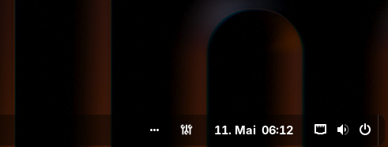

## About

Better Tray Icons puts tray icons back into the GNOME panel where they belong. You decide how many stay visible, and the rest tuck neatly away into a popup behind a toggle button.

Every icon can be renamed, hidden, reordered or swapped out for a custom one. Clicks are fully configurable for both tray icons and the toggle button, with double-click and long-press support. Spacing, padding, colors, the toggle button styling, all of it is up to you.

Settings can be exported, imported and even synced across devices through a shared JSON file with automatic backups.

## Features

Everything you need to tame the tray, and nothing you do not.

&nbsp;✓&nbsp; **Icons in the panel** with an overflow popup in row or grid layout 
&nbsp;✓&nbsp; **Drag and drop** reordering, in the panel and inside the popup 
&nbsp;✓&nbsp; **Full click control** for left, middle and right, each with double-click and long-press 
&nbsp;✓&nbsp; **Toggle-button actions** like open popup, cycle icons, action menu and open settings 
&nbsp;✓&nbsp; **Per-app overrides** to rename, hide, reorder or replace any icon 
&nbsp;✓&nbsp; **Independent styling** for tray icons, toggle button and overflow container 
&nbsp;✓&nbsp; **Hover tooltips** with configurable side and delay 
&nbsp;✓&nbsp; **Symbolic icon mode** for a clean, native look where supported 
&nbsp;✓&nbsp; **Sync and backups** through JSON export and import with automatic backups

## Screenshots

<table>
  <tr>
    <th align="center">Panel</th>
    <th align="center">Overflow (row)</th>
    <th align="center">Overflow (grid)</th>
  </tr>
  <tr>
    <td align="center"></td>
    <td align="center">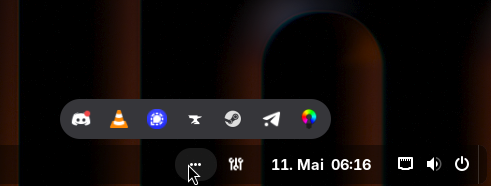</td>
    <td align="center">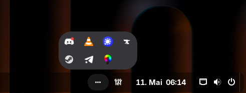</td>
  </tr>
  <tr>
    <td align="center">Toggle button in the panel. Click to reveal the rest.</td>
    <td align="center">Row layout, single line.</td>
    <td align="center">Grid layout with a configurable column limit.</td>
  </tr>
  <tr>
    <th align="center">Tooltip</th>
    <th align="center">Custom styling</th>
    <th align="center">Drag and drop</th>
  </tr>
  <tr>
    <td align="center">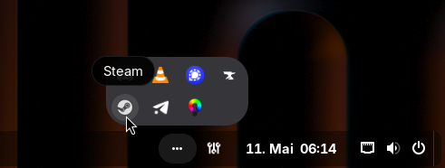</td>
    <td align="center">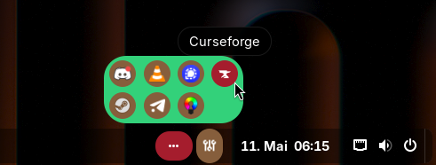</td>
    <td align="center"></td>
  </tr>
  <tr>
    <td align="center">Hover tooltip with configurable side and delay.</td>
    <td align="center">Background, radius, padding and hover color, all overridable.</td>
    <td align="center">Reorder icons in the panel and the popup.</td>
  </tr>
</table>

  
<b>Preferences window</b> (click to expand)

   
  <table>
    <tr>
      <th align="center">General</th>
      <th align="center">Appearance</th>
      <th align="center">Actions</th>
    </tr>
    <tr>
      <td align="center">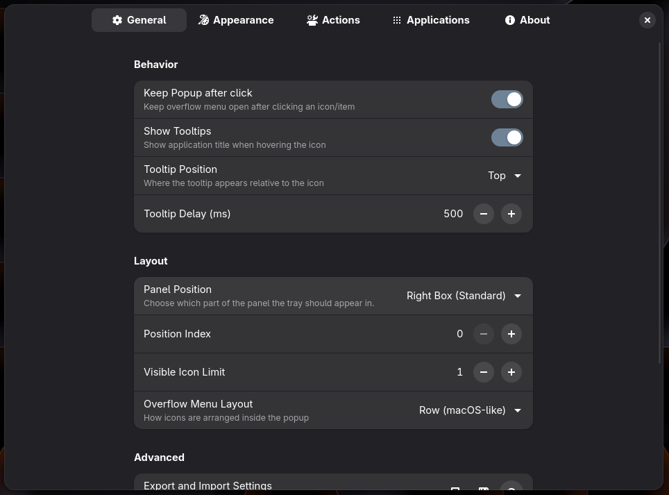</td>
      <td align="center">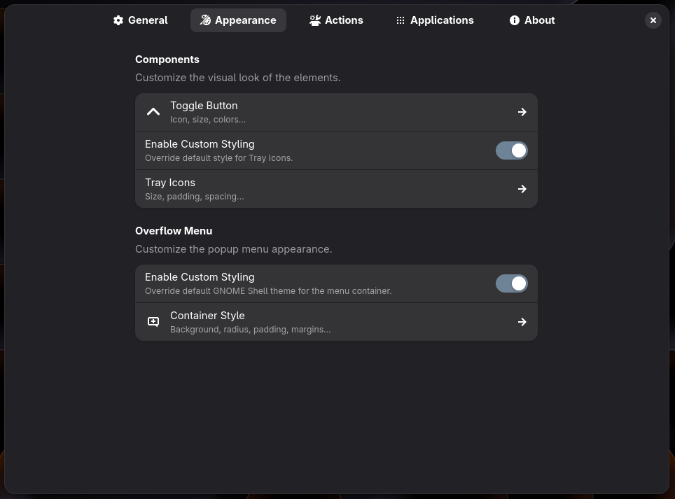</td>
      <td align="center">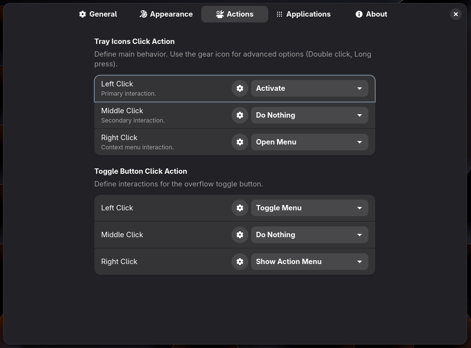</td>
    </tr>
    <tr>
      <th align="center">Applications</th>
      <th align="center">Icon picker</th>
      <th align="center">Sync</th>
    </tr>
    <tr>
      <td align="center">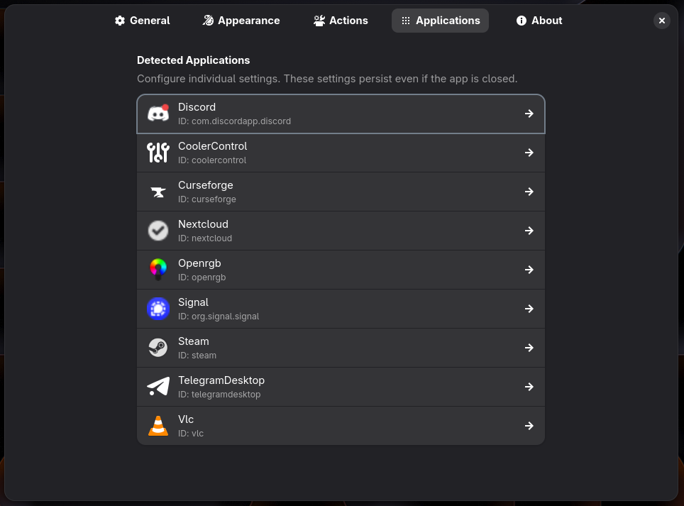</td>
      <td align="center">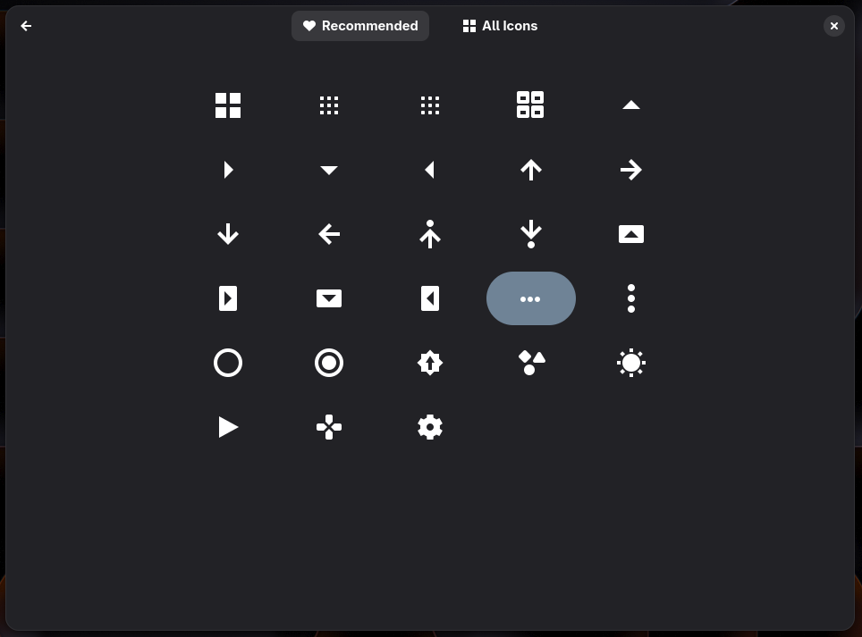</td>
      <td align="center">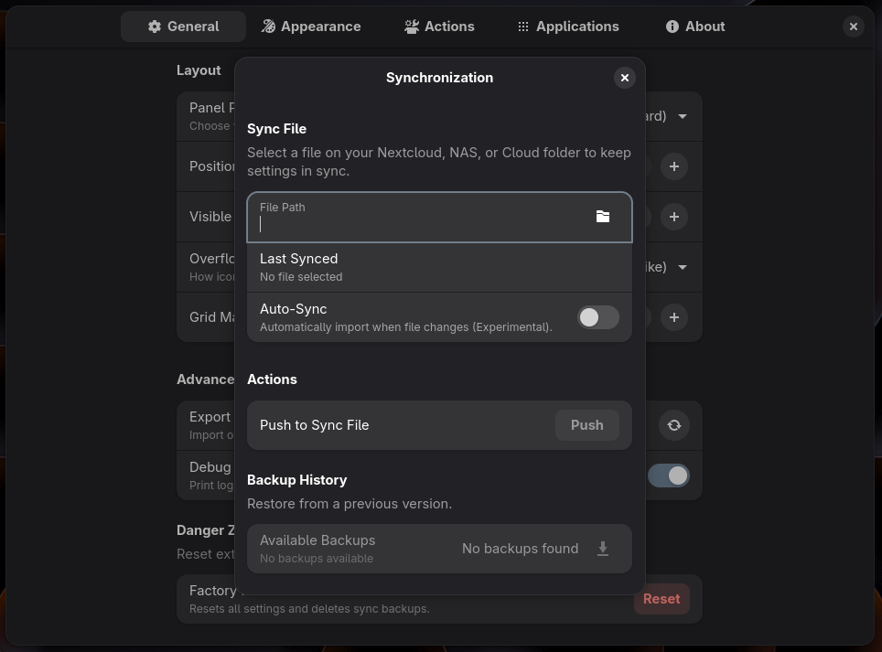</td>
    </tr>
  </table>

## Installation

The easiest way to get Better Tray Icons is straight from the [**GNOME Extensions website**](https://extensions.gnome.org/extension/9975/better-tray-icons/). One click and you are done.

Prefer building from source? The [Installation wiki page](../../wiki/Installation) has the development version covered.

## Compatibility

Better Tray Icons targets the **two most recent stable GNOME Shell releases**. Check [`metadata.json`](metadata.json) for the exact versions of the current build.

> [!NOTE]
> Wayland only. X11 sessions are not supported.

## Conflicts

Disable any other tray or AppIndicator extension before enabling this one, otherwise both will fight over the same DBus names. The Extensions app warns about this up front, because the conflicting UUIDs are declared in [`metadata.json`](metadata.json):

- `appindicatorsupport@rgcjonas.gmail.com` (AppIndicator and KStatusNotifierItem Support)
- `ubuntu-appindicators@ubuntu.com`
- `trayIconsReloaded@selfmade.pl`

## Translating

Help with translations is very welcome, both new languages and improvements to existing ones. Have a look at the [translation guidelines](https://github.com/nexaknight/BetterTrayIcons/wiki/Translation-Guidelines) before opening a PR.

## Contributing

This extension could be even better with your help. The [Contributing guide](CONTRIBUTING.md) walks you through setting up the dev environment, filing bug reports and submitting changes.

## Credits

<table>
  <tr>
    <td valign="top" width="50%">
      <b>Project inspiration</b>
      <ul>
        <li><a href="https://github.com/ubuntu/gnome-shell-extension-appindicator">AppIndicator/KStatusNotifierItem support for GNOME Shell</a></li>
        <li><a href="https://github.com/MartinPL/Tray-Icons-Reloaded">Tray Icons: Reloaded</a> by MartinPL</li>
        <li><a href="https://github.com/cassidyjames/background-app-icons">Background App Icons</a> by cassidyjames, for the background app menu</li>
      </ul>
    </td>
    <td valign="top" width="50%">
      <b>DBus interfaces</b>
        
      Interface XML files from the upstream specifications that <a href="https://github.com/ubuntu/gnome-shell-extension-appindicator">AppIndicator</a> links to.
    </td>
  </tr>
  <tr>
    <td valign="top" width="50%">
      <b>Preferences layout</b>
        
      The About page takes a few cues from <a href="https://github.com/home-sweet-gnome/dash-to-panel">Dash to Panel</a> by Home Sweet GNOME.
    </td>
    <td valign="top" width="50%">
      <b>Preference icons</b>
      <ul>
        <li>Mostly <a href="https://github.com/lucide-icons/lucide">Lucide</a> (ISC)</li>
        <li>Some derived from <a href="https://github.com/feathericons/feather">Feather</a> (MIT) by Cole Bemis</li>
        <li>Wine glyph from <a href="https://github.com/somepaulo/MoreWaita">MoreWaita</a> (GPL-3.0)</li>
      </ul>
    </td>
  </tr>
</table>

Full per-icon attribution and the license texts live in [assets/icons/CREDITS](assets/icons/CREDITS).

## License

Better Tray Icons is available under the terms of the **GPL v3 or later** license. See [LICENSE](LICENSE) for the full text.

Made with care by <a href="https://github.com/nexaknight">NexaKnight</a>. If it makes your panel tidier, consider leaving a star.

